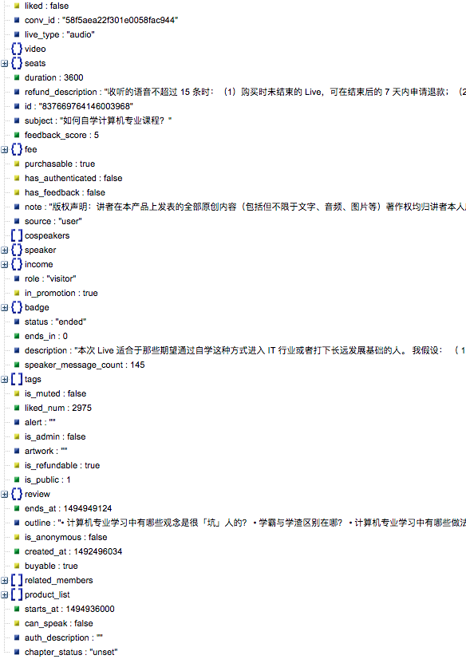

## ZhiHu Crawler 知乎爬虫
Crawling data from ZhiHu Live and store them in json lines format. 

从知乎Live中爬取30天热门数据，包括问题信息，Host信息，金额等。爬取后的数据以json lines的形式保存在zhihu_live.js文件中。爬取数据如下所示：

每个知乎Live的评论也被爬取，并且保存在comments文件夹中。其中的文件对应于知乎Live的id，可以从上面的zhihu_live.jl中的获取。爬取数据如下所示：

## Usage 使用方法
More reference can be found in the file zhihu_crawling/readme.md. 使用方法参见zhihu_crawling/readme.md文件

## References 参考项目

[Scrapy爬虫 - 获取知乎用户数据](https://github.com/ansenhuang/scrapy-zhihu-users)
