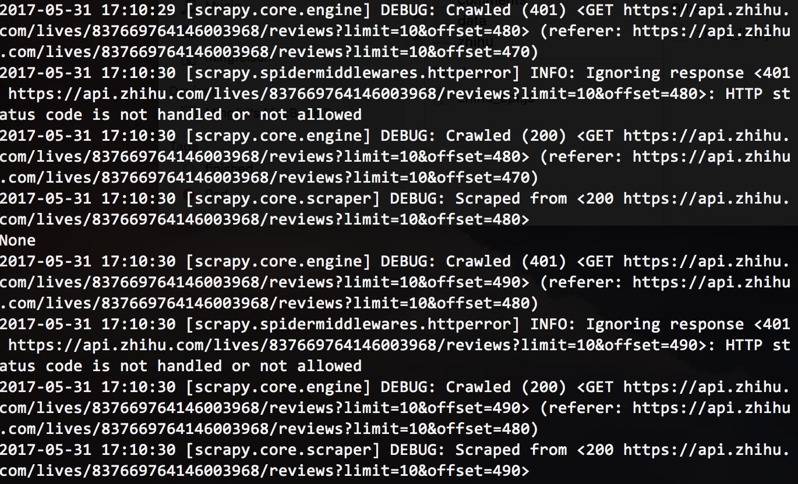
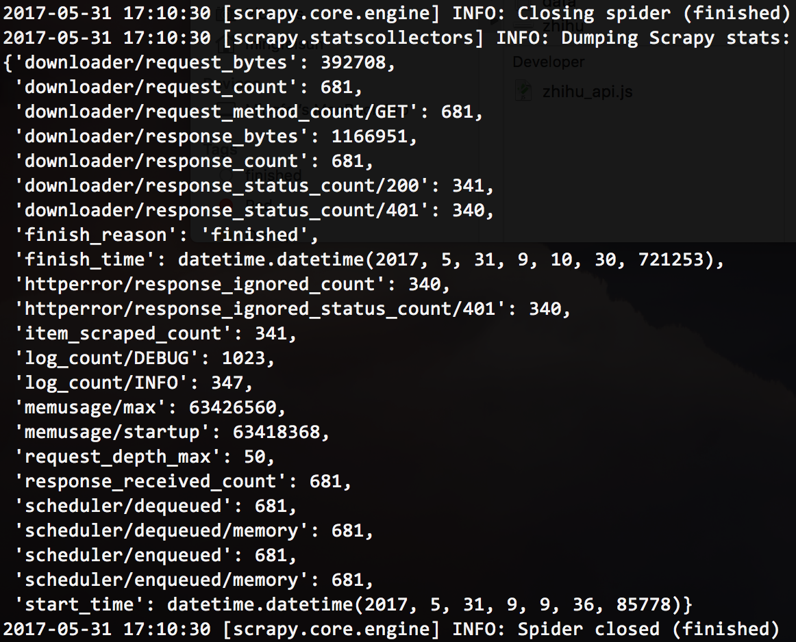

## Descriptions
This repo is to crawl data from ZhiHu live: https://www.zhihu.com/lives/hot/monthly

## How to Use
* Install [scrapy](https://scrapy.org/) library for Python
``` python
sudo pip install scrapy
```
* Install [pandas](http://pandas.pydata.org/) library for python
``` python
sudo pip install pandas
```
* Clone this repo and change to the scrapy project folder
``` bash
git clone https://github.com/mingfeisun/zhihu_crawler.git
cd zhihu_crawling
```
* Run the project
``` bash
scrapy crawl zhihu_live
```
* Running interface



* Stop interface



## Final Scraped Data
> ZhiHu Live data: *zhihu_live.jl* 
> ZhiHu Live comments: *comments/*
> Format: json lines

## Acknowledgement
Some codes are refered from the open project [Scrapy爬虫 - 获取知乎用户数据](https://github.com/ansenhuang/scrapy-zhihu-users).
